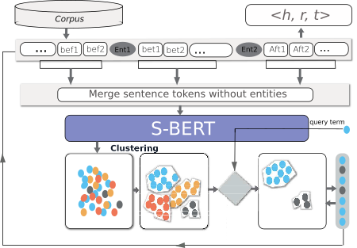

# US-BERT
The code in this repository is based on the paper(Unsupervised relation extraction using BERT based sentence encoding)





To run the relation extraction system use the following command:

```
python3 main.py Evaluation/Eval_NYT/data/AnnotatedANLP_NYT__sample.txt  PER LOC 2
```

The data has already annotated with NER system. For a particular relation provide the types of the entities PER (Person), LOC (Location) ORG (Organization); also, provide the number of clusters. The number of clusters depends on the size of the corpus.
The basic configuration of the system mentioned in the paper is given in the config.txt file.
The system generates the output and saves it in 'Evaluation/Eval_NYT/data/'


### Authors 
* [Manzoor Ali](https://dice-research.org/ManzoorAli) (DICE, Paderborn University)
* [Muhammad Saleem](https://sites.google.com/site/saleemsweb/) (AKSW, University of Leipzig)
* [Axel-Cyrille Ngonga Ngomo](https://dice-research.org/AxelCyrilleNgongaNgomo) (DICE, Paderborn University)


