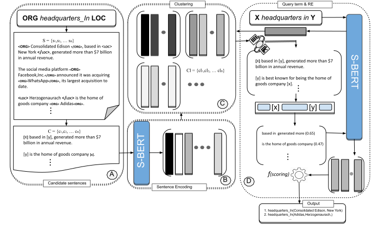

# SURE: A Sentence encoding based approach for Unsupervised Relation Extraction
SURE is an unsupervised system for relationship extraction relying on sentence vector representations (i.e., sentence enocoding). For more details please refer to: The paper

## Architecture: system description

<hr/>

## Dependencies
You need to have Python 3.6 or above and the following libraries installed:

##### NLTK: http://www.nltk.org/
##### sKlearn: https://scikit-learn.org/stable/
##### Numpy: https://numpy.org/ 
##### Sentence-Transformers: https://www.sbert.net/
##### Pandas: https://pandas.pydata.org/
##### Pytorch: https://pytorch.org/

which you can install issuing the following command:
```
pip install -r requirements.txt
```
## Usage:
To run the relation extraction system use the following command:
```
python main.py corpus entity_type1 entity_type2
```
##### Config
```
between_length: 6             # Maximum number of tokens between two entities       
before_after_window: 3        # Maximum number of tokens before the first entity and maximum number of tokens after second entity
similiraty: 0.25              # Cosine similirity threshold during the first iteration
top_similar: 15               # Maximum number of top similar sentences to the query term using cosine similarity
query_term: born in           # Natural language representation for relationship birthPlace
```
##### corpus
A sample sentence in the corpus is one sentence per line, with tags identifing the named type of named-entities, e.g.:
```
<ORG> Consolidated Edison </ORG>, based in <LOC> New York </LOC>, generated more than $7 billion in annual revenue.
The social media platform <ORG> Facebook,Inc.</ORG> announced it was acquiring <ORG>WhatsApp</ORG>, its largest acquisition to date.
<LOC> Herzogenaurach </LOC> is the home of goods company <ORG> Adidas<ORG>.
```


##### entity types
Two named entity types are provided initally for a particular relation for example, for rleation headquarterIn we provide ORG (Organization) and LOC (Location).

## Dataset used

| *Dataset*   | *Download*  |
|-------------|-----------|
|NYT-FB dataset|[Download](http://iesl.cs.umass.edu/riedel/ecml/)|
|Wikipedia_Wikidata dataset|[Download](https://www.informatik.tu-darmstadt.de/ukp/research_6/data/lexical_resources/wikipedia_wikidata_relations/)|
|English gigaword|[Download](https://drive.google.com/file/d/0B0CbnDgKi0PyM1FEQXJRTlZtSTg/view)|

## Run with basic configuration

```
python main.py Evaluation/Eval_NYT/data/AnnotatedANLP_NYT__sample.txt  PER LOC 2
```
### Authors
  * [Manzoor Ali](https://dice-research.org/ManzoorAli) (DICE, Paderborn University) 
  * [Muhammad Saleem](https://sites.google.com/site/saleemsweb/) (AKSW, University of Leipzig) 
  * [Axel-Cyrille Ngonga Ngomo](https://dice-research.org/AxelCyrilleNgongaNgomo) (DICE, Paderborn University)

